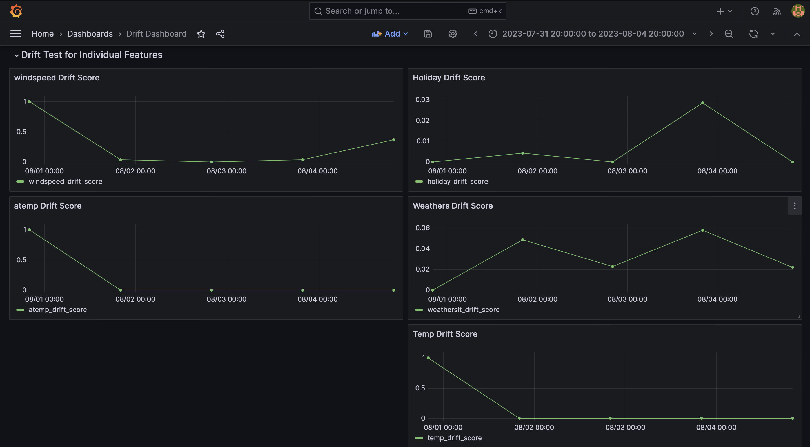
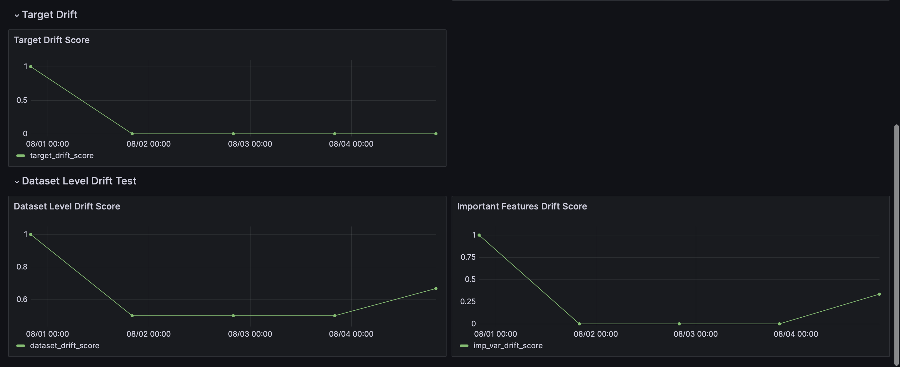

# Giskard + Grafana for Data Drift Monitoring

In the tutorial we learnt how to use Giskard to monitor data drift. In this tutorial we'll learn how to use Grafana to visualize the results of the test suite.

The idea is to periodically run the test suite and store the results in a database. Then we can use Grafana to visualize the results. We'll be using the `postgres` database for this tutorial.

## Explain the code and the file structure

We'll be using docker to setup Grafana, Postgres, and Adminer. We'll be using Adminer to interact with the Postgres database.

The `grafana_datasources.yaml` file contains the configuration for the Postgres database. The `grafana_dashboards.yaml` file contains the configuration for the dashboard. The `metrics.json` file contains the details of the dashboard.

The `data` directory contains the raw data and the reference data. The `model` directory contains the model we trained earlier. The `src` directory contains the source code for this tutorial.

We'll be using the `docker-compose.yaml` file to setup Grafana, Postgres, and Adminer. We'll be using the `db.py` file to interact with the Postgres database. The `giskard_drift_test_suites.py` file contains the test suite we created earlier. The `main.py` file contains the code to run the test suite and store the results in the database.

## Setup Grafana, Postgres, and Adminer

To setup Grafana, Postgres, and Adminer we can run the following command:

```bash
docker-compose up -d
```

To stop the containers we can run the following command:

```bash
docker-compose stop
```

Once, the containers are up and running we can access Grafana at `http://localhost:3000/` and Adminer at `http://localhost:8080/`.

To access the Postgres database we can use the following credentials: username: `postgres`, password: `postgres`, database: `giskard_monitoring`.

To access the Grafana dashboard we can use the following credentials: username: `admin`, password: `grafana`.

## Run the test suite and store the results in the database

We'll try to mock the production environment by using the `raw_data.parquet` file. We'll use the `reference_data.parquet` file as the reference data. Periodically we'll run the test suite on the five slices of the `raw_data.parquet` file each with 100 rows. We'll store the results of the test suite in the Postgres database. Then we'll use Grafana to visualize the results.

To run the test suite and store the results in the database we can run the following command in the root directory of the project:

```bash
python src/main.py
```

## Screenshots of the Grafana dashboard




