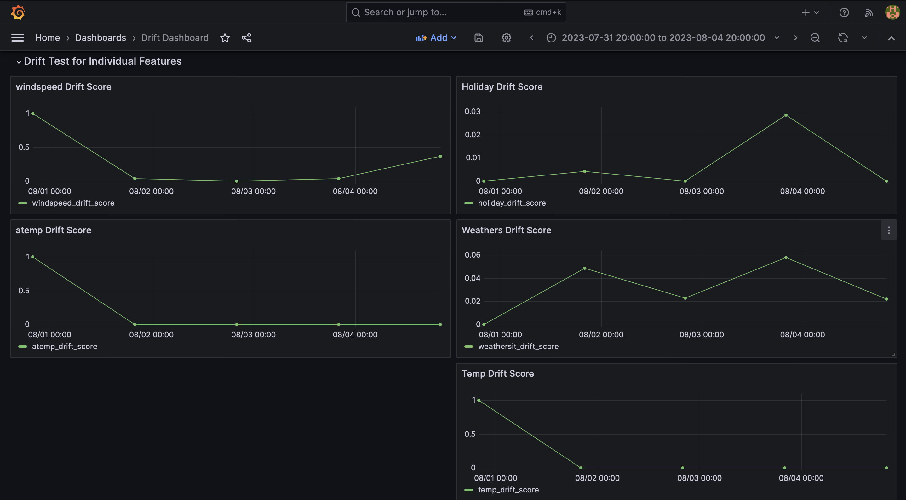
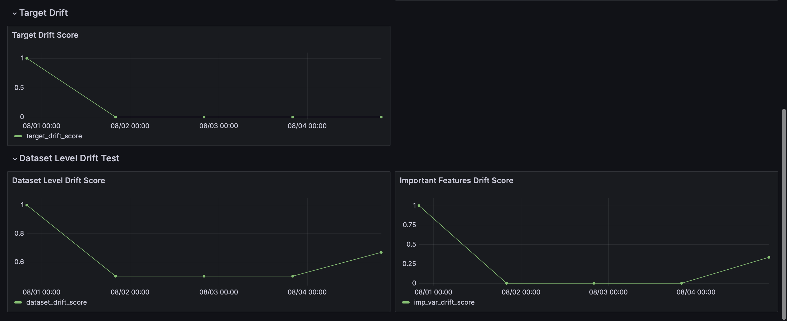

# Giskard + Grafana for Data Drift Monitoring

This repository contains the code for the tutorial on using Giskard and Grafana for data drift monitoring.

## File structure

- **config**: It contains the configuration files for Grafana. The `grafana_datasources.yaml` file contains the configuration for the PostgreSql database. The `grafana_dashboards.yaml` file - contains the configuration for the dashboard.
- **dashboards**: Contains the JSON file defining our Grafana dashboard, detailing its layout, panels, and queries.
- **data**: This is where our reference and raw data (raw_data.parquet) reside, the latter simulating our production data.
- **model**: It contains the model we'll be using to perform the drift test on the target variable.
- **notebook**: Contains a Jupyter notebook used for initial experiments and development.
- **src**: It contains the source code for this tutorial. `db.py` manages database connections, `giskard_drift_test_suites.py` is for creating test suites, and `main.py` orchestrates running these tests and storing results.

## Setup Grafana, Postgres, and Adminer

To setup Grafana, Postgres, and Adminer we can run the following command:

```bash
docker-compose up -d
```

To stop the containers we can run the following command:

```bash
docker-compose stop 
```

To stop and remove the containers we can run the following command:

```bash
docker-compose down
```

Once up, we can access Grafana at `http://localhost:3000/` (login with admin/admin, and you'll be prompted to change the password), and Adminer can be accessed at `http://localhost:8080/` (system: PostgreSQL, username: postgres, password: postgres, database: giskard_monitoring).

## Run the test suite and store the results in the database

We'll try to mock the production environment by using the `raw_data.parquet` file. We'll use the `reference_data.parquet` file as the reference data. Periodically we'll run the test suite on the five slices of the `raw_data.parquet` file each with 100 rows. We'll store the results of the test suite in the Postgres database. Then we'll use Grafana to visualize the results.

To run the test suite and store the results in the database we can run the following command in the root directory of the project:

```bash
python src/main.py
```

Visualize the results in Grafana at `http://localhost:3000/`.

## Screenshots of the Grafana dashboard




